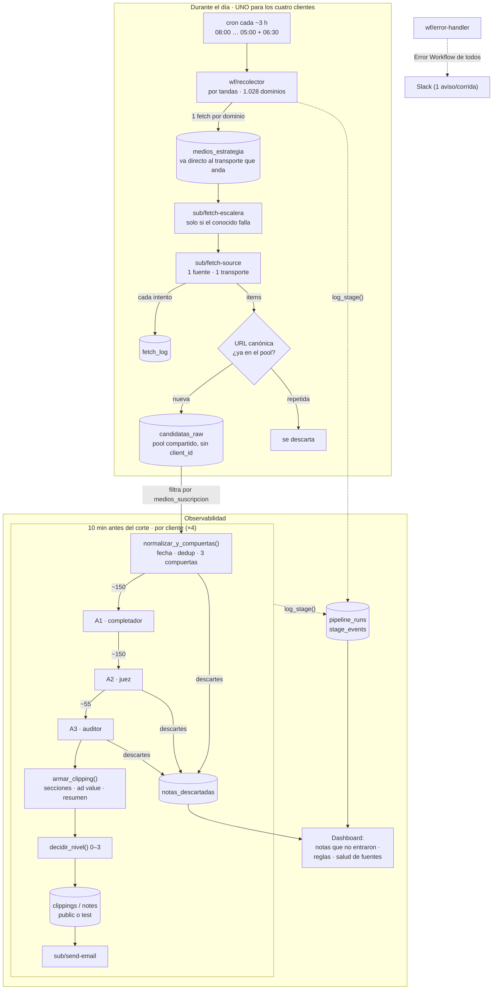
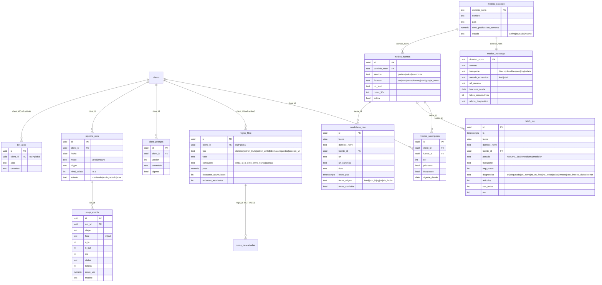

# Design Doc — Pipeline v4 de Clipping

> **Qué es:** el documento técnico de cómo se construye la v4 del pipeline de clipping. Se escribe antes de codear, se discute y se aprueba.
>
> **Ciclo de vida:** este doc es la **propuesta en revisión**. La revisión se hace sobre la rama `feat/pipeline-v4` (PR), no en Google Docs. Al aprobarlo un segundo, pasa a `aprobado` y la rama se vuelve la fuente viva. Todo cambio de arquitectura / tablas / flujo se refleja acá **en el mismo cambio**.
>
> **Diagramas:** Mermaid, versionados con el texto.

---

## 0. Meta

| | |
|---|---|
| **Proyecto** | Ketchum · módulo Clipping · Pipeline **v4** (rediseño de ingesta y filtrado) |
| **Autor** | Archytas |
| **Fecha de creación** | 2026-09-03 |
| **Última actualización** | 2026-09-04 — Fase 2 cerrada; **el recolector pasa a ser compartido** (revierte una decisión, ver §6); `transporte` y `metodo_extraccion` separados |
| **Estado** | `borrador` |
| **Aprobado por** | — *(pendiente; autor ≠ aprobador)* |
| **PRD / funcional** | [`pipeline-v4.md`](./pipeline-v4.md) — especificación técnica de ejecución, con el diagnóstico medido |
| **Repo de código** | `github.com/archytas-dev/ketchum-mailchimp` (dashboard Next.js + migraciones Supabase) |
| **Instancias** | n8n dedicada `n8n-ketchum.archytas.io` · Supabase `banlcbewinpjtudzdzhm` |
| **Rama de trabajo** | `feat/pipeline-v4` — fuente de verdad de la v4 hasta que se unifique a `main` |

---

## Índice

1. [Contexto y alcance](#1-contexto-y-alcance)
2. [Objetivos y no-objetivos](#2-objetivos-y-no-objetivos)
3. [Arquitectura](#3-arquitectura)
4. [Contrato de datos](#4-contrato-de-datos)
5. [Transversales](#5-transversales-no-negociables)
6. [Alternativas consideradas](#6-alternativas-consideradas)
7. [Plan de prueba y rollback](#7-plan-de-prueba-y-rollback)
8. [Riesgos y pendientes](#8-riesgos-y-pendientes)
9. [Estado de implementación](#9-estado-de-implementación)
10. [Checklist de aprobación](#10-checklist-de-aprobación)
11. [Glosario](#11-glosario)

---

## 1. Contexto y alcance

El sistema genera y envía por mail **un clipping de prensa diario para cuatro clientes** (BMS, Booking, Mars, MSD), los siete días de la semana, con cortes escalonados entre 06:45 y 07:30. Cada cliente define qué medios sigue, qué palabras clave le importan y en qué secciones se arma el reporte.

En 3 semanas el cliente cargó **601 reportes de calidad** sobre esos clippings. Agrupados por causa raíz, tres grupos concentran el 90%:

| Grupo | Reportes | Causa raíz |
|---|---|---|
| **No entró una nota** | ~168 | La fuente es inalcanzable desde la IP de n8n (el fetch directo falla el 94%); el dominio no está desglosado por sección; la nota se descarta por no tener fecha confiable. |
| **Nota vieja o repetida** | ~34 medidos, más en Slack | Dos normalizadores de URL con reglas distintas en el mismo proceso; se borra el query string; el historial anti-repetición está contaminado con URLs de redirector; el mail no deduplica. |
| **Nota no relevante** | ~191 | La IA descarta el 93% de lo que llega y decide sin criterio estable; las reglas viven como JavaScript repartido en 3 nodos × 4 workflows, con contenido distinto entre clientes. |

Más: sin fecha confiable las notas viejas pasan el filtro de 24 h para siempre; el clasificador de sección se queda con la primera palabra clave que matchea; no hay registro de *por qué* no entró una nota, así que las 570+ correcciones del equipo no alimentan nada; y la valorización (ad value) funciona en el 16% de las notas por un cruce de nombres roto.

**Lo que la v3 ya resolvió bien y la v4 conserva:** configuración en Supabase con una sola llamada, modo de prueba con schema aparte, escritura del clipping vía RPC sin webhook al flujo viejo, telemetría de corrida, tiers y ad value persistidos en la nota. La v4 **no rehace la capa de datos** — rehace la capa de **fetch y de filtrado**.

---

## 2. Objetivos y no-objetivos

**Objetivos**

- Bajar los tres grupos de reportes: recuperar las fuentes inalcanzables, cortar las repetidas/viejas, estabilizar el criterio de relevancia.
- **Trazar cada descarte:** qué regla y qué valor exacto lo sacó, visible en el dashboard, para que las correcciones del equipo ajusten la configuración.
- **El envío nunca se detiene:** una etapa que falla baja de categoría, no frena el mail.
- Cobertura de medios medible y con aviso cuando falta uno.
- Duplicar la cobertura de valorización sin trabajo del cliente.
- Un cliente nuevo = una fila y un horario, no un workflow de 100 nodos.

**No-objetivos** *(explícitamente afuera de esta entrega)*

- Las gacetillas, el editor web y la exportación.
- Los clientes en formato legado.
- Cambiar la capa de datos de la v3 (`import_clipping`, `get_config_clipping`, `log_run_stats`).
- Terminar de migrar la v3 a la instancia dedicada — la v4 la **reemplaza** cliente por cliente (leapfrog), la v3 sigue corriendo en la cuenta compartida hasta el cutover.
- ~~Un recolector único compartido por los cuatro clientes~~ — **revertido el 04/09: el recolector sí es compartido.** La medición mostró que uno por cliente cuesta 44% más de requests y golpea 299 dominios 2–4 veces por barrido. Ver §6.

---

## 3. Arquitectura

### 3.1 Diagrama del dato (punta a punta)



**Los dos principios:** (1) a la hora del corte no se sale a buscar nada — el clipping ya está decidido; (2) el envío puede salir peor, nunca puede no salir.

**Dónde entra "el cliente":** en el armado, no en la recolección. El catálogo de medios es compartido y el pool del día también (`candidatas_raw` no tiene `client_id`, a propósito). Una nota se trae **una vez** y sirve a los cuatro clientes que estén suscriptos a esa fuente; cada armado filtra el pool por `medios_suscripcion`. Recolectar por cliente significaría traer la misma nota hasta cuatro veces para guardar una sola fila — ver §6.

### 3.2 Tecnologías y por qué

| Pieza | Elección | Por qué |
|---|---|---|
| Orquestación | **n8n** (instancia dedicada `n8n-ketchum`) | Default del equipo. Instancia dedicada, no la cuenta compartida — para aislar recursos y no pisar la v3 en vuelo. |
| Base de datos | **Supabase / Postgres** (`banlcbewinpjtudzdzhm`) | Ya es la verdad de la v3. Datos de cliente + miles de filas. La lógica pura vive acá (funciones), no en n8n. |
| Transporte de fetch | **Directo + 2 proxies propios (Cloudflare Worker + Supabase Edge Function) + Bright Data** | Un medio puede tener un feed impecable y ser inalcanzable desde nuestra IP. No hay servicio gratuito de terceros que sostenga la escala (feed2json: 50/hora y deprecado; rss2json: 429; etc.). Los proxies propios son gratis en el plan free y entre los dos resolvieron 34 de 38 feeds en la prueba. Ver §3.5. |
| IA | **OpenAI** (mismo que la v3) | Costo marginal (≈ USD 6/mes). No se optimiza por ahí. |
| Dashboard | **Next.js** (repo `ketchum-mailchimp`, Vercel) | Ya existe. Las pantallas nuevas se **agregan**. |

### 3.3 Modelo de datos

Partiendo de las consultas que hace el pipeline y el dashboard: "¿qué fuentes recorro para este cliente?", "¿ya vi esta URL?", "¿por qué no entró esta nota?", "¿cómo salió la corrida de hoy?".

#### Tablas nuevas (aplicadas a `public` el 2026-09-03)



**Índices clave**

| Tabla | Índice | Consulta que acelera |
|---|---|---|
| `medios_fuentes` | `uk (dominio_norm, lower(seccion))` | una fuente por dominio×sección, sin duplicados |
| `medios_suscripcion` | `uk (client_id, fuente_id)` · `(client_id) where not bloqueado` | "las fuentes activas de este cliente" — lo que usa **el armado** para filtrar el pool (el recolector recorre el catálogo completo) |
| `reglas_filtro` | `(tipo) where activa` · `(client_id) where activa` | cargar las reglas al normalizar |
| `client_prompts` | `uk (client_id) where vigente` | el prompt vigente del juez |
| `fetch_log` | `(fecha, dominio_norm)` · `(fecha, diagnostico)` | resumen de cobertura del día |
| `candidatas_raw` | `(fecha)` · `(url_canonica)` | dedup del pool + armado |
| `pipeline_runs` | `uk (client_id, fecha, modo)` | idempotencia: una corrida por cliente/día/modo |
| `stage_events` | `(run_id, ts)` | reconstruir una corrida |

#### Tablas que se extienden (aditivo, no rompe la v3)

- **`notas_descartadas`** → +6 columnas nullable: `pipeline_run_id`, `etapa` (`normalizacion|compuerta|juez|auditor`), `regla_id` (FK a `reglas_filtro`, `NOT VALID`), `valor_que_matcheo`, `explicacion`, `recuperable`. La v3 sigue insertando por nombre de columna; las nuevas quedan `null`.

#### Tablas de la v3 que se conservan sin tocar

`clients` · `medios` (hasta el cutover) · `tiers` · `secciones` · `kw_keywords` · `google_alerts` · `gacetillas` · `notes` · `notes_precarga` · `clippings` · `run_stats` · `notas_historico_url` · `reportes` · `config_changelog` · `medios_bloqueados` · `medios_bloqueados_global`.

### 3.4 Cruces de datos

| Cruce | Clave | Por qué |
|---|---|---|
| `medios` (v3) → `medios_catalogo/_fuentes/_suscripcion` | **`dominio_norm`** = `lower(dominio)` sin `www.` | Un dominio existe una sola vez, global. El poblado inicial (2026-09-03) leyó `medios` y agrupó por dominio: 2.261 filas limpias → 1.542 dominios. 236 filas `sin-dominio:*` quedaron afuera (ticket de limpieza). |
| nota → tier / ad value | **`dominio_norm`** (objetivo) · **`tier_norm(nombre)` + `tier_alias`** (interino) | Hoy el cruce es por nombre de medio y falla: `tiers.dominio` guarda nombres (`"pulso turistico"`), las notas traen variantes. `tier_norm()` (minúsculas, sin acentos, sin `.com`, sin artículo inicial) sube la cobertura de 15,9% a 36,4% medido. Los casos que la normalización no cubre van a `tier_alias` — **alta manual, nunca match por parecido** (`"el tribuno de jujuy"` ≠ `"el tribuno"`). |
| nota → "¿ya enviada?" | **`url_canonica(url)`** contra `notas_historico_url` del **mismo cliente**, últimos 30 días | `es_repetida()`. Distinto del dedup del pool del día (§3.6). |
| descarte → regla | **`regla_id`** (uuid) | Para el contador de errores por regla en el dashboard. |

**Regla dura:** nunca cruzar por nombre si hay un id o un dominio. El bug del ad value es exactamente eso.

**Segunda regla dura, aprendida el 04/09:** `transporte` y `metodo_extraccion` son **ejes independientes** y no van en la misma columna. `transporte` dice *por dónde salgo a internet*; `metodo_extraccion` dice *cómo convierto la fuente en notas*. La v3 los tenía juntos en `medios.metodo` (donde `jina` significaba "no tiene feed, se lee la página") y la Fase 1 copió eso tal cual. La consecuencia fue concreta: el Switch de `sub/fetch-source` no tiene rama para `jina`, así que 130 fuentes caían en el fallback y se buscaban por directo, sin URL. Se separó en `[F2.7]`. **El camino `html` no es un quinto transporte** — lo sirve `sub/open-article` (§3.6).

### 3.5 APIs / contratos externos

#### Proxies de transporte

Los dos devuelven **el mismo contrato JSON** a propósito — quien llama no necesita saber por cuál salió.

| Proxy | URL | Auth | Credencial n8n |
|---|---|---|---|
| Cloudflare Worker | `https://ketchum-fetch-proxy.hola-e13.workers.dev/?url=<urlencoded>` | header `X-Api-Key` | `odT5yjmKpIORGZjK` |
| Supabase Edge Function | `https://tufgbajqgjkwqwskkcam.supabase.co/functions/v1/fetch-proxy?url=<urlencoded>` | `Authorization: Bearer <anon>` | `LLdAbQUu6q9ChKPG` |

```json
{ "ok": true, "diagnostico": "ok", "formato": "rss", "upstream_status": 200,
  "total": 10, "con_fecha": 10, "ms": 20,
  "items": [ { "titulo": "…", "url": "https://…", "fecha": "Thu, 03 Sep 2026 …", "snippet": "…" } ] }
```

`diagnostico` ∈ `ok · bloqueado · sin_items · no_es_feed · no_existe · caido · timeout · rate_limit`. Está **separado del contenido** a propósito: sin eso no se distingue "no hubo noticias" de "no pudimos entrar".

> El proxy AWS hoy vive en un **proyecto de prueba**. Falta decidir dónde vive en producción (recomendado: un proyecto Supabase aparte, compartido). El código de ambos está en [`prototipos/`](./prototipos/).

#### `sub/fetch-source` — contrato interno

```
IN : { fuente_id, dominio_norm, url, formato, transporte, pasada }   (transporte = UNO solo)
OUT: { fuente_id, dominio_norm, formato, transporte, diagnostico, http_status,
       items[], articulos, con_fecha, ms }
```

Escribe una fila en `fetch_log` por cada llamada. La **escalera** (probar el siguiente transporte) la maneja el orquestador (`sub/fetch-escalera`), no este subworkflow — así cada intento es una ejecución trazable por separado.

#### `log_stage(p_evento jsonb)` — RPC del ledger

```
p_evento = { client_id, fecha, modo, trigger, stage, fase(in|out),
             n_in, n_out, ms, status, error_txt, tokens, costo_usd, modelo }
→ uuid (run_id)
```

Upsert de `pipeline_runs` por `(client_id, fecha, modo)` + insert de `stage_events`. Lo llaman los subworkflows vía HTTP a la RPC (no Execute Workflow → no infla la lista de ejecuciones).

### 3.6 Flujos / procesos

#### Subworkflows-ladrillo (reutilizables entre los 4 clientes, contrato fijo, traza propia)

| Subworkflow | Rol | Estado |
|---|---|---|
| `sub/fetch-source` | 1 fuente, 1 transporte → contrato + `fetch_log` | **construido y probado** |
| `sub/fetch-escalera` | la escalera `directo → cloudflare → aws`, corta en el primero con `articulos>0` | **construido y probado** |
| `sub/open-article` | abre una nota individual (para A1) por su propia escalera | pendiente |
| `sub/llm-call` | llamada al modelo + 1 retry + backoff 429 + tope de tokens/cliente + registra tokens/costo en `stage_events` | pendiente |
| `sub/slack-notify` | aviso consolidado a Slack (formato del §7 del PRD) | pendiente |
| `sub/send-email` | envío con **guarda dura**: excepción si `modo != prod` | pendiente |
| `sub/agent-A1` `A2` `A3` | los tres agentes (ver abajo) | pendiente |

**Escalera de transporte** (la arma `sub/fetch-escalera`, no `sub/fetch-source`):

```
metodo_extraccion = feed              metodo_extraccion = html
  1. directo                            no va por la escalera de feeds:
  2. cloudflare                         lo sirve sub/open-article (Fase 5)
  3. aws                                sobre la misma escalera de transporte
  4. brightdata   (solo vs. bloqueo)
```

Corta en el primero con `articulos > 0`. Escala **solo** con `diagnostico ∈ (bloqueado, caido, timeout)` — nunca con `sin_items`. Guarda el transporte ganador en `medios_estrategia`.

**Medido el 03/09 sobre las 1.260 fuentes con URL usable:** cloudflare resuelve 774, directo 138, brightdata 32, aws 16. **El proxy no es el plan B, es el camino principal** — cualquier diseño que asuma "directo salvo excepción" está mal calibrado. Y el cuarto escalón (Bright Data, pago) va **solo contra el bloqueo, nunca contra el timeout**: recupera 31 de 45 bloqueadas (69%) y apenas 3 de 20 con timeout (15%), porque 15 de esas 20 son fuentes rotas de verdad.

**A partir de la Fase 3 el recolector no sube la escalera en cada barrido:** lee `medios_estrategia` y va derecho al transporte que ya se sabe que funciona. Solo si ese falla sube la escalera, y ahí actualiza la estrategia.

#### Orquestadores (uno por responsabilidad; solo el armado se instancia ×4)

| Workflow | Trigger | Qué hace | Estado |
|---|---|---|---|
| `wf/recolector` **×1, compartido** | cron cada ~3 h (08:00 · 11 · 14 · 17 · 20 · 23 · 02 · 05) + **06:30**, disparado por webhook | recorre **el catálogo compartido por tandas** (1.028 dominios con transporte que funciona), leyendo `medios_estrategia` para ir derecho al que anda; **dedup por `url_canonica`** contra el pool del día → solo entran URLs nuevas a `candidatas_raw` | pendiente |
| `wf/armado-cliente` ×4 | ~10 min antes del corte del cliente | filtra el pool por `medios_suscripcion` de ese cliente → `normalizar_y_compuertas` → A1 → A2 → A3 → `armar_clipping` → `decidir_nivel` → guardar → `sub/send-email` | pendiente |
| `wf/descubridor` (A0) | webhook, por tandas, fuera de la ventana de envío | agarra las fuentes sin transporte y prueba ~17 rutas por dominio **saliendo por Cloudflare**, más una segunda vuelta leyendo lo que declaran la home (`<link rel="alternate">`) y el `robots.txt` (`Sitemap:`). Escribe `medios_fuentes.url_feed` + `medios_estrategia` solo con lo verificado | ✅ **construido y corrido** (04/09): 152 fuentes recuperadas de 442 |
| `wf/salud` | post-envío | cobertura del día, fuentes mudas (N × ritmo de publicación), volumen esperado **por día de la semana** | pendiente |
| `wf/error-handler` | Error Workflow de todos los workflows nuevos | consolida a Slack (1 aviso/corrida) + escribe el fallo en `stage_events` | pendiente |
| `v4 · medición · cobertura` | webhook, por tandas | recorrió las 1.260 fuentes con URL usable por la escalera → `fetch_log` (`pasada='medicion'`). No manda mails ni toca tablas de cliente. | ✅ **corrido (03/09)** — dio el gate. Ya cumplió su función |

#### Los tres agentes

| Agente | Tipo | Sobre qué | Puede frenar |
|---|---|---|---|
| **A1 · completador** | agente con herramientas | las ~30 notas incompletas de ~400: detecta qué falta (fecha, descripción, título, medio) y **va a buscarlo**. Limpia HTML de descripciones, corta el sufijo del medio en títulos, reemplaza la descripción cuando es de otra nota. | **No.** Si sigue incompleta, pasa marcada y el auditor decide. |
| **A2 · juez** | modelo con salida estructurada, lotes de 12 | relevancia · geografía · sección, leyendo el mismo texto una vez. Lee `client_prompts` (versionado) + la tabla de secciones. Escala a modelo grande si confianza < 0,80 o fuente prioritaria. | **No.** Y **no puede descartar** una nota de fuente prioritaria o que menciona una marca del cliente — sobre esas solo decide la sección. |
| **A3 · auditor** | determinístico + modelo, sobre el clipping entero | chequeos duros (saca la nota culpable, no frena el envío) + blandos (avisan) + **repesca** de descartes con score 0,4–0,6. | **No.** No tiene la palabra "no" en su vocabulario. |

*(La división es por **tipo de trabajo** —completar / juzgar / auditar—, no un agente por chequeo: la fecha/título/descripción se resuelven yendo a buscar el dato; relevancia/geografía/sección se deciden leyendo el mismo texto. Ver §6.)*

#### Funciones puras (Postgres — una definición, cuatro clientes)

| Función | Qué hace | Estado |
|---|---|---|
| `tier_norm(text)` | normaliza nombre de medio para el cruce de valorización | **final, probada** |
| `url_canonica(text)` | forma única de una URL: desenvuelve redirectores, saca tracking (conserva el id del artículo), normaliza host y barra | **v1** — falta el decode base64 de los redirectores del agregador (Fase 4) |
| `resolver_fecha(jsonb)` | cascada feed → JSON-LD → og → URL. Si ninguna: `confiable=false`, **nunca pone la de hoy** | **v1** — se endurece en Fase 4 |
| `es_repetida(uuid, text)` | ¿la `url_canonica` ya está en el historial de ese cliente en 30 días? | **v1** |
| `normalizar_y_compuertas()` | normaliza → resuelve fecha → deduplica (una regla) → aplica las 3 compuertas | pendiente (Fase 4) |
| `armar_clipping()` | orden de secciones, ad value, resumen — **determinístico** | pendiente (Fase 6) |
| `decidir_nivel()` | elige el nivel de salida 0–3 según qué etapas anduvieron | pendiente (Fase 6) |
| `log_stage(jsonb)` / `set_run_outcome(uuid,int,text)` | escriben el ledger | **aplicadas** |

#### Idempotencia (desde el diseño)

- **Guardar el clipping:** upsert por `(client_id, fecha)`, no insert.
- **Guardar una nota / un descarte / una fila de `fetch_log`:** clave `(clipping_id, url_canonica)` / `(client_id, fecha, url_canonica)` / `(dominio, fuente_id, pasada, fecha)`.
- **Enviar el mail:** bandera `enviado_at` — si ya tiene valor, no se manda de nuevo.
- **Dedup del pool:** una nota cuya `url_canonica` ya está en `candidatas_raw` del día se ignora.
- Correr el mismo día dos veces produce **exactamente** el mismo clipping y **un solo** mail. Es un test del golden.

---

## 4. Contrato de datos

**Entrada** (lo que trae el recolector, por fuente):

| Formato | Qué se pide | Devuelve fecha |
|---|---|---|
| `rss` / `wordpress` | feed XML / `/wp-json/wp/v2/posts` | sí |
| `sitemap` | `sitemap-news.xml` | sí (`lastmod`, a veces sin hora) |
| `html` | portada parseada (vía renderizador) | no confiable |
| `google_news` | redirect del agregador | sí, pero hay que decodificar la URL |

Cada nota candidata: `{ url, titulo, snippet, fecha_pub, fecha_origen, fecha_confiable }`. Una fecha **sin hora** se marca y **nunca se compara contra un corte horario**, solo contra el día.

**Salida** (el clipping): notas agrupadas por sección (orden de la tabla del cliente), cada una con medio, titulo, descripción, link, fecha y ad value; más el resumen del día y, al pie, la ventana cubierta (*"desde el 01/09 07:00 hasta el 02/09 06:30"*). Se guarda en `public` (o en el schema de prueba) **antes** de armar el mail; el mail se arma leyendo lo guardado.

---

## 5. Transversales (no negociables)

### Accesos y seguridad

- **RLS en toda tabla nueva**, desde el día uno. Patrón: staff-only (`is_staff()`) para la infra del pipeline; `has_client_access(client_id)` para `medios_suscripcion`; el cliente lee `tier_alias`.
- **Secretos en Credentials de n8n**, nunca en un nodo Set. Las tres keys de proxy de la v4 ya están en credenciales. **⚠️ La v3 sigue con 3 API keys en texto plano en un nodo `GSID`** — la rotación era `[F0.3]` y la Fase 0 se omitió, así que **siguen expuestas**; una es de un servicio que se cobra por uso. Migrarlas a Credentials es parte del reemplazo.
- Funciones nuevas con `set search_path` fijo. Las `security definer` (`log_stage`, `es_repetida`) siguen el mismo patrón que `log_run_stats` ya en producción — el bypass de RLS es intencional (n8n escribe a tablas con RLS de staff vía PostgREST).
- **Schema de prueba:** se reusa el `test` que ya existe (28 tablas clonadas, la v3 lo usa en modo prueba). **⚠️ Asegurarlo era `[F0.6]` y la Fase 0 se omitió:** `get_advisors` (04/09) reporta **las 28 tablas sin RLS**, legibles y vaciables con la clave pública del front, y el backup congelado tiene el mismo agujero. **La Fase 3 va a escribir ahí tal como está.** Es la deuda de seguridad abierta más grande del proyecto.

### Manejo de errores / alertas

- **Cada workflow nuevo tiene Error Workflow asignado** antes de activarse → `wf/error-handler`, que consolida (un aviso por corrida, no uno por fuente caída).
- **Ningún nodo nuevo lleva `continueOnFail` sin un `catch`** que registre el motivo en `stage_events`. Hoy casi todos los nodos de la v3 tragan el error y devuelven lista vacía — por eso "perder datos" y "un día tranquilo" se ven igual.
- **Escalera de degradación** (nivel de salida) en vez de frenar:

| Nivel | Qué se cayó | Qué sale | Aviso |
|---|---|---|---|
| 0 | nada | clipping completo y auditado | — |
| 1 | auditor / ad value / resumen | todo menos ese dato | Slack, sin urgencia |
| 2 | juez (429, timeout, basura) | solo el filtro determinístico — más ruido, no falta ninguna | Slack a las 06:45 |
| 3 | pool vacío | el clipping de ayer, **marcado como tal** | llamado al on-call |

- **Cortafuegos de OpenAI:** ante 429, **un** retry con backoff; si vuelve a fallar, baja a nivel 2. No hay loop. Tope de tokens por cliente/día calculado sobre el consumo real de 30 días.
- **Bots conversacionales:** N/A en este proyecto (no hay bot conversacional), pero si se agregara, aplica el mandamiento 7 (circuit breaker por repetición).

### Idempotencia

Ver §3.6. Es un test del golden, no una promesa.

### Observabilidad

- **Ledger:** `pipeline_runs` + `stage_events` — cada corrida y cada etapa al entrar y al salir (in/out counts, ms, status, error; tokens/costo en las de agente).
- **`fetch_log`:** un renglón por intento de fetch, ande o no.
- **`notas_descartadas`:** por qué no entró cada nota, con la regla y el valor exacto.
- **Golden harness:** la v4 decide idénticamente sobre los mismos datos que la v3 antes de reemplazar nada. Mismo patrón usado en otros proyectos de clipping.
- **4 pantallas nuevas** en el dashboard: notas que no entraron · reglas de filtrado · salud de fuentes · medios sin valorizar.

---

## 6. Alternativas consideradas

| Alternativa | Por qué se descartó |
|---|---|
| ~~**Recolector único compartido por los 4 clientes**~~ → **se descartó el 03/09 y se volvió a adoptar el 04/09.** Es lo que se construye. | El motivo original para descartarlo era el riesgo de que "una corrida de ~1.800 medios agote recursos y se caiga". **Ese número no era real:** con transporte que funciona son **1.028 dominios**, no 1.800. Y medido, uno por cliente cuesta **44% más de requests** (1.480 vs 1.028 por barrido; 13.320 vs 9.252 por día) y golpea **299 dominios 2–4 veces en la misma ventana desde la misma IP** — el patrón de bloqueo autoinfligido que la higiene previa quería justamente eliminar. Peor: `candidatas_raw` **no tiene `client_id`**, el pool ya es compartido por diseño, así que las copias 2ª–4ª se descartan por dedup — se paga el fetch cuatro veces para guardar una fila. El riesgo de recursos se resuelve como se resolvió en el descubridor: **por webhook y en tandas**, no partiendo por cliente. El "por cliente" se mueve al armado, que es donde el cliente de verdad importa. |
| **Tres pasadas nocturnas (00:00 / 03:00 / 05:30) + pasada caliente** (PRD) | Se simplificó a un barrido cada ~3 h con la última a las 06:30. Cubre el mismo objetivo (frescura + cobertura) con un solo esquema, y hay medios que rotan sus notas a lo largo del día, no solo de madrugada. |
| **Servicios gratuitos de terceros para el fetch** (feed2json, rss2json, allorigins…) | Probados todos el 02/09: feed2json 50/hora y deprecado ("no usar en producción"); rss2json 77/90 → 429; allorigins/codetabs caídos. El valor no es convertir XML a JSON (20 líneas), es la IP y el ancho de banda — eso cuesta plata. Un transporte del que dependemos tiene que ser nuestro o tener contrato. |
| **Jina Reader para feeds** | Devuelve markdown, se pierde la fecha del feed (el dato que arregla las notas viejas). Probadas 5 formas de pedirle el crudo, ninguna funciona. Jina sí sirve para **páginas HTML** (A1). |
| **Schema de prueba nuevo (`clipping_ensayo`)** | Se creó y se revirtió. El `test` que ya existe cumple la misma función, la v3 ya le apunta, y tiene las 28 tablas clonadas. Menos es más: se reusa y se asegura. |
| **Un agente por chequeo (6+ agentes)** | Fecha/título/descripción se resuelven *yendo a buscar el dato*; relevancia/geografía/sección se deciden *leyendo el mismo texto*. Separarlas en llamadas distintas es pagar tres veces por leer la misma nota y hace que dos notas parecidas se decidan distinto. La división correcta es por tipo de trabajo. |
| **El LLM arma el clipping** (ordena, agrupa, calcula ad value, HTML) | Dos corridas del mismo día darían dos clippings distintos → no se puede testear nada, se pierde el golden. Los agentes deciden *qué entra*; el código decide *cómo se ve*. |
| **Migrar la v3 a la instancia dedicada primero, y sobre eso construir v4** | La v4 leapfrog: construir desde cero en la instancia dedicada y reemplazar cliente por cliente. Menos trabajo intermedio, y el golden compara contra la v3 real corriendo en paralelo. |

---

## 7. Plan de prueba y rollback

**Prueba**

| Fase | Con qué datos | Qué se prueba |
|---|---|---|
| Local | los 38 feeds del benchmark + curl a los proxies | que los proxies traen lo que dicen (hecho) |
| n8n aislado | `sub/fetch-source` / `sub/fetch-escalera` contra feeds reales | contrato, parseo, escritura a `fetch_log` (hecho) |
| Medición | `v4 · medición · cobertura` sobre las 1.260 con URL usable, después `wf/descubridor` sobre las 442 rotas | ✅ **hecho (03–04/09).** 960 entraban por transporte; el descubridor sumó 152 → **1.112 de 1.437 (77%)** |
| Schema de prueba | modo `ensayo` → schema `test`, mail al equipo | que el pipeline decide igual sin tocar datos de cliente |
| Golden | copia de un día real del cliente piloto | que la v4 decide **idéntico** a la v3; cada diferencia se explica antes de avanzar |
| Producción | un cliente (Booking), con la v3 prendida en paralelo | que el mail sale y es el mismo |

**Rollback**

- El flujo v3 queda **desactivado, no borrado**, 30 días. Volver = desactivar el nuevo y activar el viejo. Dos clicks, sin deploy.
- Las migraciones son aditivas y reversibles (`DROP TABLE` / `DROP COLUMN IF EXISTS` / `DROP FUNCTION`). Nada de `DROP`/`RENAME`/cambio de tipo sobre lo que usa la v3.
- Disparador de rollback definido **antes** de arrancar: dos días seguidos con volumen fuera de banda, o una queja del cliente.

---

## 8. Riesgos y pendientes

| # | Riesgo / pendiente | Impacto |
|---|---|---|
| 1 | ~~**Gate de la medición.**~~ **Resuelto (03–04/09).** Entran 1.112 de 1.437 fuentes activas (77%). El bloqueo prácticamente no era el problema: queda **1 fuente bloqueada en 1.260**. | El riesgo se corrió de lugar: no es de red, es de **calidad de la configuración de fuentes**. |
| 1b | **El techo es 77–85%, no ~96%.** El descubridor recupera el 35% de lo roto, no casi todo. Quedan **178 fuentes sin feed** que dependen del camino HTML (§3.6) y ~147 con feed a las que no se llega. | Cualquier promesa de cobertura al cliente se hace sobre 77–85%. La v4 hereda un agujero más chico que la v3, pero lo hereda. |
| 2 | **Carga de n8n:** 1 recolector × ~9 barridos/día × 1.028 dominios = ~9.252 fetches/día. | Memoria y duración del barrido. Mitigación: **por tandas y por webhook** — medido, la ejecución manual muere con volumen alto porque n8n retiene el set en memoria para mostrarlo. Y el barrido va derecho al transporte conocido, no sube la escalera entera. |
| 2b | **Techo de memoria por tanda, medido:** 35 dominios × ~17 candidatas retienen **21 MB** en el nodo HTTP; 70 matan el proceso. | Aplica a todo flujo que retenga cuerpos HTML. Tandas chicas y no pedir dos veces la misma página. |
| 2c | **PostgREST corta las lecturas en 1.000 filas y no avisa.** Pedir `limit=2000` sobre 1.437 fuentes devuelve 1.000 y el flujo calcula sobre un universo truncado sin fallar. | Todo flujo que lea `medios_fuentes` (1.437) o `medios_suscripcion` (2.102) por REST tiene que **paginar** y fallar ruidosamente si la última página viene llena. |
| 2d | **Un PATCH que no matchea ninguna fila devuelve 204, igual que uno exitoso.** | Los nodos de escritura van **en paralelo**, no encadenados (con `Prefer: return=minimal` el primero devuelve `{}` y deja al segundo sin campos), y las escrituras **se cuentan por `statusCode`, nunca por cantidad de items** — con `onError: continue` un fallo también produce item. |
| 3 | ~~**Credencial de Bright Data** sin configurar.~~ **Cargada** (`Jg1RLQ26OX2pQgzE`). | 32 fuentes entran solo por ahí. Se cobra por request y hoy corre en plan de prueba: **falta dimensionar el costo del volumen real** (~9.252 fetches/día) y decidir si ese 3% lo vale. |
| 4 | **Dónde vive la Edge Function AWS en producción** (hoy en un proyecto de prueba). | Decisión pendiente. Recomendado: proyecto Supabase aparte compartido. |
| 5 | **Drift de migraciones del repo** (preexistente): ~5 migraciones locales sin par remoto, ~12 remotas sin archivo. `supabase db push` no es seguro hasta reconciliar. | Ticket aparte. Las migraciones de la v4 se aplican por MCP con la versión exacta = archivo, así que esas sí alinean. |
| 6 | **Zonas horarias.** Todo se guarda en UTC, se decide en `America/Argentina/Buenos_Aires`; los cron de n8n en UTC con el equivalente ART en el nombre del nodo. Resolver antes de escribir el recolector. | Una nota publicada 23:30 ART del lunes llega como 02:30 UTC del martes — si el corte se compara mal, entra dos veces o ninguna. |
| 7 | **Fecha fresca-falsa:** un sitio sin RSS confiable cuya portada casi no cambia, del que el scraper "descubre" notas viejas con timestamp de hoy. El dedup del mail las corta a partir de la 2ª aparición; la 1ª necesita un guard de fecha (meta/JSON-LD/cuerpo) — sin diseñar. | Bajo (el fix del mail cubre la mayor parte). |

---

## 9. Estado de implementación

*(2026-09-04. `feat/pipeline-v4`.)*

| Fase | Alcance | Estado |
|---|---|---|
| **0 · Higiene** | apagar corridas duplicadas · rotar 3 API keys expuestas · quick-win ad value (`tier_norm` de los 2 lados) · limpiar historial de URLs de redirector · asegurar schema `test` · arreglar `client_id` v3 | ⛔ **OMITIDA** (decisión del 04/09). Sigue siendo deuda real: **las 28 tablas de `test` sin RLS** — que la Fase 3 va a usar tal como están —, las 3 API keys en texto plano, la valorización al 16% en vez del 36% medido, y el historial sucio que hereda la Fase 4. |
| **1 · Modelo de datos** | 11 tablas nuevas + 6 columnas en `notas_descartadas` + 6 funciones + ledger + poblado del catálogo | ✅ **aplicado a producción.** Migraciones `20260903174914` → `20260903190200`. Verificado: 11 tablas con RLS, `get_advisors` sin hallazgos nuevos en `public`. Catálogo: 1.542 dominios · 1.542 fuentes · 2.102 suscripciones. |
| **2 · Transporte** | `sub/fetch-source` · `sub/fetch-escalera` · medición de cobertura · `wf/descubridor` · separar `metodo_extraccion` | ✅ **cerrada (04/09).** Los dos subworkflows validados end-to-end. Medición corrida sobre las 1.260 con URL: **960 entraban**. Descubridor construido y corrido sobre las 442 rotas: **+152 fuentes → 1.112 (77%)**. `[F2.7]` separó `transporte` de `metodo_extraccion`. Abierto: `[F2.5]` dónde vive el proxy AWS en producción · `[F2.6]` baja de las 46 inalcanzables · `[F2.2c]` re-correr otro día las 107 con feed vacío. |
| **3 · Recolector + schema prueba** | sincronizar `test` con `public` · **`wf/recolector` ×1 compartido, por tandas** · dedup por URL canónica · cierre de cobertura · saltear y registrar las 178 `metodo_extraccion='html'` hasta que exista `sub/open-article` | **en curso** ← acá estamos |
| **4 · Normalización + compuertas** | `url_canonica` v2 (base64) · `normalizar_y_compuertas()` · poblar `reglas_filtro` desde el JS de la v3 · reconstruir el historial con `url_canonica` | pendiente |
| **5 · Agentes** | `sub/llm-call` · `sub/open-article` · `sub/agent-A1/A2/A3` | pendiente |
| **6 · Armado + degradación** | `armar_clipping()` · `decidir_nivel()` · `sub/send-email` (guarda dura) · `sub/slack-notify` · `wf/salud` · `wf/error-handler` | pendiente |
| **7 · Dashboard** | 4 pantallas + sonda de alta + `config_changelog` + fixes puntuales | pendiente (arranca en paralelo apenas exista `descartes` + `reglas_filtro`) |
| **8 · Golden + cutover Booking** | arnés de golden · staging · cutover · rollback | pendiente |
| **9 · Replicar** | BMS → Mars → MSD | pendiente |

### Workflows y credenciales creados en `ketchum-n8n`

| Objeto | ID | Estado |
|---|---|---|
| `v4 · sub · fetch-source` | `UUIlvhTv3Rjy9YEP` | activo (lo llama un orquestador) |
| `v4 · sub · fetch-escalera` | `TyXVALaeUzfPlgv8` | activo |
| `v4 · wf · descubridor (A0)` | `nvShglwLuHqgF5cp` | **inactivo** — se activa a mano para correrlo. Webhook `POST /v4-descubridor`, body `{cliente, grupo, limite, offset, modo}`; `modo=test` (default) no escribe nada |
| `v4 · medición · cobertura FINAL (por tandas)` | `lVRHLZaL5VCmfWFK` | activo, webhook — **ya cumplió su función**, candidato a archivar |
| `v4 · medición · escalera pendiente` | `2yemtvcIABA0KB34` | activo, webhook — ya cumplió, candidato a archivar |
| `ZZ · OBSOLETO · medición cobertura` | `XpeIOEJg92H1hrrJ` | inactivo, roto — **borrar** |
| cred `Ketchum — Fetch Proxy (Cloudflare)` | `odT5yjmKpIORGZjK` | cargada |
| cred `Ketchum — Fetch Proxy (AWS/Supabase)` | `LLdAbQUu6q9ChKPG` | cargada (key del proyecto de prueba) |
| cred `Ketchum — Fetch Proxy (Brightdata)` | `Jg1RLQ26OX2pQgzE` | cargada |

> **Ninguno de los workflows v4 puede notificar hacia afuera.** No tienen nodos de Slack ni de mail, y el `Ketchum — Error Handler (puente al Global)` está **desactivado** (posteaba a Slack `customer-ketchum`). Decisión operativa del 04/09.

---

## 10. Checklist de aprobación

- [x] Diagrama de arquitectura (Mermaid) — §3.1
- [x] Modelo de datos con tablas + índices — §3.3
- [x] Cruces de datos explícitos y por qué clave — §3.4
- [x] Manejo de errores / alertas — §5
- [x] Accesos / RLS — §5
- [x] Idempotencia — §3.6
- [x] Plan de prueba + rollback — §7
- [x] Alternativas consideradas (≥1 descartada con motivo) — §6
- [ ] **Aprobado por un 2º** — pendiente

*Filtro final: ¿se aprueba solo leyéndolo? ¿un dev nuevo lo reconstruye en 6 meses sin que le cuenten?*

---

## 11. Glosario

| Término | Qué es |
|---|---|
| **Fuente** | Una puerta de entrada a un medio: dominio × sección. La ingesta recorre fuentes, no dominios. |
| **Formato vs. transporte** | Formato = qué se le pide (feed, sitemap, HTML). Transporte = cómo se llega (directo, proxy propio, renderizador, IP residencial). Independientes: una fuente puede tener un feed impecable y ser inalcanzable desde nuestra IP. |
| **Escalera** | Probar los transportes en orden hasta el primero que trae notas. La arma `sub/fetch-escalera`. |
| **Barrido** | Una pasada del recolector **compartido** por el catálogo entero. Cada ~3 h + una última a las 06:30. |
| **Pool del día** | Las notas que juntaron los barridos del día, **compartidas por los cuatro clientes** (`candidatas_raw` no tiene `client_id`). Cada barrido suma solo lo nuevo (URL canónica que no estaba); cada armado lo filtra por las suscripciones de su cliente. |
| **Transporte vs. método de extracción** | Dos ejes independientes. `transporte` = por dónde salgo a internet (directo, proxy, IP residencial). `metodo_extraccion` = cómo convierto la fuente en notas (`feed` o `html`). Mezclarlos en una columna fue un bug del modelo, corregido en `[F2.7]`. |
| **URL canónica** | Forma única de una URL tras desenvolver redirectores, sacar tracking (conservando el id del artículo) y normalizar host y barra. Base del dedup. |
| **Fecha confiable** | Fecha del feed / datos estructurados / metadatos / URL. Si no hay ninguna: la nota no se descarta por antigüedad y **no se le inventa la de hoy**. |
| **Compuerta** | Regla determinística: entra sí o sí / no entra nunca / puntúa. Los descartes duros son sobre la fuente y los hechos (dominio, fecha, idioma), nunca sobre el tema. |
| **Nivel de salida (0–3)** | Cuánto se degradó el clipping. 0 = completo y auditado; 3 = el de ayer, marcado. |
| **Golden** | La v4 tiene que decidir idénticamente sobre los mismos datos que la v3 antes de reemplazar nada. |
| **Cutover** | El momento en que un cliente pasa a la v4. Reversible en dos clicks; la v3 queda apagada 30 días. |
| **Modo prueba** | Perilla al arrancar: cron → schema real + mail al cliente + historial; botón → schema `test` + mail al equipo + historial intacto. |
| **Ledger** | `pipeline_runs` + `stage_events`: cada corrida y cada etapa al entrar y al salir, para que un día roto no se vea igual que un día tranquilo. |

---

*Regla de actualización: el que cambia arquitectura / tablas / flujo actualiza este doc en el mismo cambio y toca "Última actualización". Cambios grandes posteriores → línea de decisión en `decisiones.md`, no reescribir todo. Código tocado + doc sin tocar = desfasado.*
